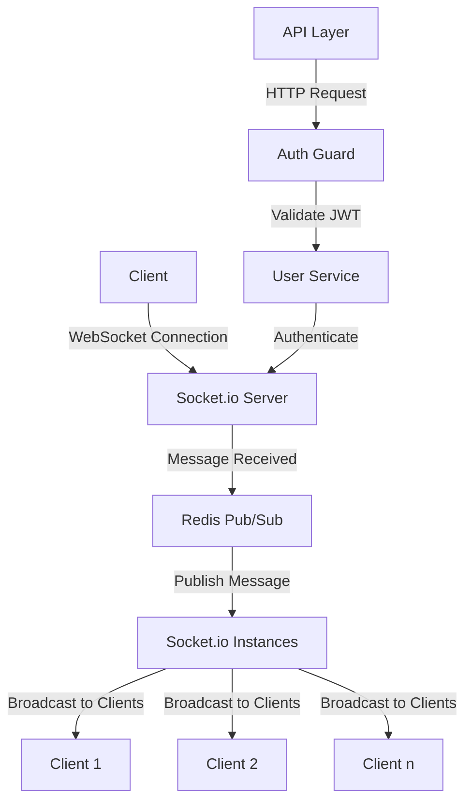

### Project Description

Welcome to the ultra-friendly, super-casual yet extremely technical journey of building a backend service for a commenting system! This project is your go-to for posting, retrieving, editing, and deleting comments with top-notch user authentication and best security practices. Buckle up for a verbose ride through the backend architecture, database choices, authentication strategies, and the fancy cache layer we implemented! We are diving deep into each and every part of this architecture, dissecting every decision, and discussing the rationale behind our choices.

### Backend Architecture

Alright, let's dive into the nitty-gritty of our backend architecture. This project is a finely-tuned orchestra of microservices, each playing its part in perfect harmony. Here's a comprehensive overview of our architecture:

- **Microservices**:
  - **API**: The gateway to our application, handling incoming requests and directing traffic.
  - **AUTH**: Responsible for user registration, login, and JWT authentication.
  - **CACHE**: Our Redis layer for super-fast data retrieval.
  - **POST**: Manages all things related to posts.
  - **COMMENT**: Handles commenting functionality.
  - **MONGO**: Our primary database, storing user, post, and comment data.
  - **REDIS**: Our caching layer, reducing load on the database.
  - **MQTT**: The message broker for real-time updates and communication between services.

Each service is isolated, ensuring that we can scale, update, and maintain them independently. This isolation enhances fault tolerance, as a failure in one service won't necessarily bring down the entire system.

### Why MongoDB?

MongoDB is our NoSQL database of choice. Why? Let's break it down:

- **Scalability**: MongoDB scales horizontally by sharding, making it perfect for handling large volumes of data. For example, suppose our application grows to handle millions of comments. In that case, MongoDB can distribute the data across multiple servers, ensuring that no single server is overwhelmed. This means we can maintain high performance even as our data grows exponentially.
- **Flexibility**: The schema-less nature of MongoDB allows for easy updates to the data model without downtime. Imagine we need to add a new field to our comments; with MongoDB, we can do this on the fly without having to migrate the entire database schema.
- **Performance**: With its efficient indexing and querying capabilities, MongoDB delivers high performance for read and write operations. This is crucial for our commenting system, where users expect real-time interactions. MongoDB's ability to handle large volumes of concurrent read and write operations ensures that our system remains responsive.
- **Popularity**: MongoDB has a vibrant community and extensive documentation, making it easier to find support and resources. This means that as our team grows, new developers can quickly get up to speed with MongoDB, leveraging the vast array of resources available.

### Why NestJS?

NestJS is our framework of choice, and here's why it rocks:

- **Modularity**: NestJS promotes a modular architecture, allowing for better organization and scalability of the codebase. Each module in NestJS encapsulates a specific piece of functionality, making it easier to manage and scale. For example, our commenting functionality can be a separate module, isolated from the user authentication module.
- **TypeScript**: Built with TypeScript, NestJS provides type safety and modern JavaScript features. TypeScript catches errors at compile time, reducing runtime errors and making our code more reliable. It also provides better tooling support, with features like autocompletion and refactoring, enhancing developer productivity.
- **Dependency Injection**: Makes managing dependencies a breeze, improving testability and maintainability. With dependency injection, we can easily swap out implementations for testing, ensuring that our code is modular and testable.
- **Ecosystem**: NestJS has a rich ecosystem of libraries and tools that integrate seamlessly. For example, we can easily add authentication, validation, and caching capabilities using NestJS-compatible libraries, accelerating our development process.

### MQTT

MQTT is our message broker, and it's a game-changer for real-time communication:

- **Lightweight**: MQTT is designed for lightweight communication, making it ideal for real-time updates. It's optimized for minimal network bandwidth and resource usage, ensuring that our system remains responsive even under heavy load.
- **Scalability**: Easily scales to handle numerous connections and messages. MQTT can manage thousands of concurrent connections, making it suitable for applications that require real-time updates for a large number of users.
- **Reliability**: Ensures reliable message delivery with its quality of service levels. MQTT supports different levels of message delivery guarantees, from at most once to exactly once, ensuring that our messages are delivered reliably.

### Full Architecture Explained

Our architecture is designed for efficiency, scalability, and reliability. Here’s a deep dive into each component and the decision-making process behind it:

1. **API Layer**:
   - **Functionality**: Handles incoming HTTP requests, validates them, and routes them to the appropriate microservice.
   - **Why**: By separating the API layer from the business logic, we ensure a clean separation of concerns. This makes the system more modular and easier to maintain.
   - **Benefits**: Enhanced security, as we can implement API-specific security measures like rate limiting and input validation.

2. **Auth Layer (Guard)**:
   - **Functionality**: Manages user authentication using RSA-signed HTTP-only JWTs.
   - **Why**: JWTs are stateless, meaning they don't require server-side session storage, making the system more scalable.
   - **Benefits**: Secure authentication with minimal performance overhead. RSA signing ensures that tokens can't be tampered with, and HTTP-only cookies prevent client-side access to the tokens.

3. **Cache Layer (Redis)**:
   - **Functionality**: Acts as a caching layer to speed up data retrieval. Implements both read-through and write-through caching.
   - **Why**: Caching reduces the load on the primary database, improving performance and scalability.
   - **Benefits**: Faster response times for frequently accessed data, reduced database load, and improved overall system performance.

4. **Microservices**:
   - **POST & COMMENT**: Handle CRUD operations for posts and comments, interacting with MongoDB.
   - **CACHE**: Manages caching operations, ensuring quick access to frequently accessed data.
   - **AUTH**: Manages user authentication, registration, and login processes.

5. **MQTT**:
   - **Functionality**: Facilitates real-time communication between microservices.
   - **Why**: Ensures timely updates and synchronization across services, crucial for real-time applications.
   - **Benefits**: Low latency, reliable message delivery, and scalability to handle numerous concurrent connections.

### Authentication: RSA-Signed HTTP-Only JWT

We use RSA-signed HTTP-only JWTs for authentication. Here’s why this approach is solid:

- **Security**: RSA signing ensures that tokens are tamper-proof. HTTP-only cookies prevent client-side scripts from accessing the tokens.
- **Scalability**: JWTs are stateless, allowing for easy scaling without session management.
- **Interoperability**: JWTs can be easily used across different systems and technologies.

### Cache Layer and the Fancy Stuff

Our cache layer, powered by Redis, is a key player in enhancing performance. Let's break down its functionalities and the magic behind it:

#### Write-Through Caching
When a user writes data (e.g., posts a comment), the data is written to both the cache and the database simultaneously. This ensures that the cache is always up-to-date.

#### Read-Through Caching
When data is requested, it is first checked in the cache:
- **Cache Hit**: If the data is found in the cache, it is returned immediately.
- **Cache Miss**: If the data is not found in the cache, it is fetched from the database and then cached for future requests.

#### Efficient Pagination
We use `ZRANGEBYSCORE` for cursor-based pagination. Here's how it works:
- **Initial Request**: The client requests the first page of data with a `startScore` of `0` and an `endScore` of the current timestamp.
- **Subsequent Requests**: The client requests the next page of data with a `startScore` equal to the timestamp of the last fetched item and an `endScore` of the current timestamp. This ensures that each page contains unique data.

### Scalability

Scalability is a critical consideration in our architecture. Here's how we've designed the system to scale:

#### Horizontal Scaling
- **Microservices**: Each service can be scaled independently based on its load. For example, if the commenting functionality experiences a spike in usage, we can scale the COMMENT service without affecting other services.
- **MongoDB**: Sharding allows us to distribute data across multiple servers, ensuring that no single server becomes a bottleneck.
- **Redis**: We can deploy Redis in a clustered setup, distributing the cache across multiple nodes for better performance and reliability.

#### Real-World Numbers
- **Latency Reduction**: Using Redis, data retrieval latency can be reduced from approximately 100ms (database) to around 1ms (cache).
- **Throughput**: MongoDB sharding can handle petabytes of data and thousands of operations per second. This means we can manage millions of comments and user interactions without degrading performance.
- **Concurrent Connections**: MQTT can handle thousands of concurrent connections, ensuring real-time updates for a large number of users.

### Flow Diagram

Let's visualize the architecture with a flow diagram:

### Comment System Architecture Diagram

Here is the architecture diagram for the comment system:

```mermaid
graph TD
    A[API Layer] -->|HTTP Request| B(Auth Guard)
    B -->|Validate JWT| C[Cache Layer (Redis)]
    C -->|Cache Hit| D[Return Response]
    C -->|Cache Miss| E[Post/Comment Service]
    E -->|Fetch Data| F[MongoDB]
    F -->|Return Data| E
    E -->|Update Cache| C
    E -->|Return Data| A
    A --> G[Return Response to Client]
    H[MQTT] --> E
    H --> C
```

### Explanation

#### Comment System

- **API Layer**: Receives HTTP requests from clients and routes them to the appropriate services.
- **Auth Guard**: Validates JWTs to ensure that requests are authenticated.
- **Cache Layer (Redis)**: Checks if the requested data is in the cache. If found (cache hit), it returns the data immediately. If not found (cache miss), it forwards the request to the relevant service.
- **Post/Comment Service**: Handles CRUD operations for posts and comments, interacting with MongoDB for persistent storage.
- **MongoDB**: Stores all user, post, and comment data.
- **MQTT**: Facilitates real-time updates and communication between services.
- **Cache Update**: On a cache miss, the fetched data from MongoDB is stored in the cache for future requests.

### Cache Layer in Detail

Let's dive deeper into the cache layer and the fancy stuff we did with it:

#### Functionality Breakdown
1. **Data Storage**:
   - **Hashes**: We store each post, comment, and user data as Redis hashes. This allows us to efficiently retrieve and update individual fields.
   - **Sorted Sets**: We use sorted sets to index posts and comments. The score in the sorted set is the timestamp of creation, enabling efficient range queries for pagination.

2. **Cache Operations**:
   - **Add Data**: When a new post or comment is created, it is added to both the cache and the database.
   - **Update Data**: When a post or comment is updated, the corresponding hash in the cache is also updated.
   - **Delete Data**: When a post or comment is deleted, it is removed from both the cache and the database.

3. **Pagination**:
   - **ZRANGEBYSCORE**: We use this Redis command to fetch a range of elements based on their score (timestamp). This enables efficient cursor-based pagination.

#### Benefits of the Cache Layer
- **Reduced Latency**: Serving data from the cache reduces response times, providing a better user experience.
- **Decreased Database Load**: By caching frequently accessed data, we reduce the number of queries to the primary database, improving overall system performance.
- **Scalability**: The cache layer can be scaled independently, allowing us to handle increased load without overloading the database.

### Real-World Comparison

Let's compare our choices with alternatives and explain why we chose each component:

1. **MongoDB vs. SQL Databases**:
   - **SQL Databases**: Provide strong consistency and structured schemas. However, they can become bottlenecks at scale due to the complexity of JOIN operations and the difficulty of horizontal scaling.
   - **MongoDB**: Offers better scalability and flexibility, allowing us to handle large volumes of data with ease. Its schema-less nature provides the flexibility to adapt to changing requirements without downtime.

2. **JWT vs. Session-Based Authentication**:
   - **Session-Based Authentication**: Requires server-side session storage, which can become a scalability issue as the number of users grows.
   - **JWT**: Stateless and easily scalable. By using RSA-signed JWTs stored in HTTP-only cookies, we ensure secure and scalable authentication.

3. **REST vs. GraphQL**:
   - **REST**: Simple and widely adopted. It is suitable for most use cases and integrates well with existing systems.
   - **GraphQL**: Allows clients to request exactly the data they need, reducing over-fetching and under-fetching. However, it introduces complexity in setting up and managing the schema. For our use case, REST provides the simplicity and flexibility we need.

### Chat and Socket.io

I started building and designing the initial architecture for the chat functionality using Socket.io but couldn't finish due to bandwidth limitations. Here's an overview of what was planned and partially implemented:

#### Architecture Overview

- **Socket.io**: For real-time communication between the client and the server. This allows for instant message delivery and updates.
- **Redis Pub/Sub**: Used to ensure message delivery with low complexity. Redis Pub/Sub provides a reliable and efficient way to handle message broadcasting and ensures that messages are delivered to all connected clients.
- **HTTP-Only Authentication**: Secure user authentication using HTTP-only cookies to prevent client-side access and potential security vulnerabilities.

#### Benefits of the Architecture

1. **Real-Time Communication**: Socket.io provides real-time, bidirectional communication between clients and servers. This is essential for chat applications where users expect instant message delivery and updates.

2. **Scalability with Redis**: By integrating Redis Pub/Sub, I can ensure that messages are delivered across multiple instances of the application. This is crucial for scaling the chat functionality horizontally. Redis handles the distribution of messages efficiently, allowing the system to scale and handle a large number of concurrent connections and messages.

3. **Low Complexity**: Redis Pub/Sub is relatively simple to implement and manage, providing a straightforward way to handle message broadcasting without the need for complex setups.

4. **Secure Authentication**: Using HTTP-only cookies for authentication enhances security by preventing access to the authentication tokens from client-side scripts. This reduces the risk of cross-site scripting (XSS) attacks.

#### Scalability Factors

- **Horizontal Scaling**: With Socket.io and Redis Pub/Sub, the chat service can be scaled horizontally. Multiple instances of the chat service can be run, and Redis ensures that messages are distributed to all instances. This allows the system to handle a growing number of users and messages without degrading performance.
  
- **Efficient Message Delivery**: Redis Pub/Sub efficiently manages the distribution of messages, ensuring that all connected clients receive the messages in real-time. This reduces the load on the application servers and ensures that the chat remains responsive even under heavy load.

- **Real-World Example**: In a production environment, if I have thousands of users connected to the chat, Redis Pub/Sub will distribute the messages across all connected clients efficiently. This ensures that each user receives messages without delay, providing a seamless chat experience.


### Chat Application Architecture Diagram

Here is the architecture diagram for the chat application:


#### Chat Application

- **Client**: Connects to the server using WebSocket through Socket.io for real-time communication.
- **Socket.io Server**: Handles incoming messages from clients and communicates with Redis Pub/Sub to distribute messages.
- **Redis Pub/Sub**: Ensures message delivery across multiple Socket.io server instances.
- **Socket.io Instances**: Multiple instances of Socket.io servers to handle scaling. Each instance can broadcast messages to connected clients.
- **API Layer**: Handles HTTP requests related to user authentication.
- **Auth Guard**: Validates JWTs for secure communication.
- **User Service**: Authenticates users and ensures they are authorized to use the chat service.

### Frontend 

Welcome to the frontend part of our commenting system! This project is built using Next.js, React Query, Zod, and useForm to ensure highly reusable components and efficient data management. We have styled the application with Tailwind CSS. The focus has been primarily on functionality rather than UI/UX design.

## Stack Overview

- **Next.js**: A React framework for building server-side rendered (SSR) and static web applications.
- **React Query**: For fetching, caching, and synchronizing server state in React applications.
- **Zod**: A TypeScript-first schema declaration and validation library.
- **useForm**: A library for managing form state in React.
- **Tailwind CSS**: A utility-first CSS framework for rapid UI development.

## Features

- **Highly Reusable Components**: The components are designed to be highly reusable and composable.
- **Form Management**: Efficient form handling using useForm.
- **Server State Management**: Data fetching and state management with React Query.
- **Validation**: Schema validation using Zod.

## Key Libraries

- **Next.js**: Provides the backbone for our application with built-in SSR and static site generation (SSG) capabilities.
- **React Query**: Manages server state and data fetching, providing caching, synchronization, and background updates.
- **Zod**: Ensures that all data conforms to the expected schema, providing type safety and validation.
- **useForm**: Simplifies form state management and validation.
- **Tailwind CSS**: Allows for quick and efficient styling with utility classes.

## Folder Structure

Here's a brief overview of the folder structure:

- **components**: Reusable React components.
- **hooks**: Custom hooks, including data fetching hooks.
- **pages**: Next.js pages.
- **styles**: Tailwind CSS configurations and custom styles.
- **utils**: Utility functions and Zod schemas.

## Notes

- **UI/UX**: The focus has been on functionality, not on perfecting the UI/UX. Feel free to improve and customize the design.
- **Reusability**: Components are built to be reusable across different parts of the application.
- **Forms**: Forms are handled efficiently using useForm and validated with Zod schemas.

